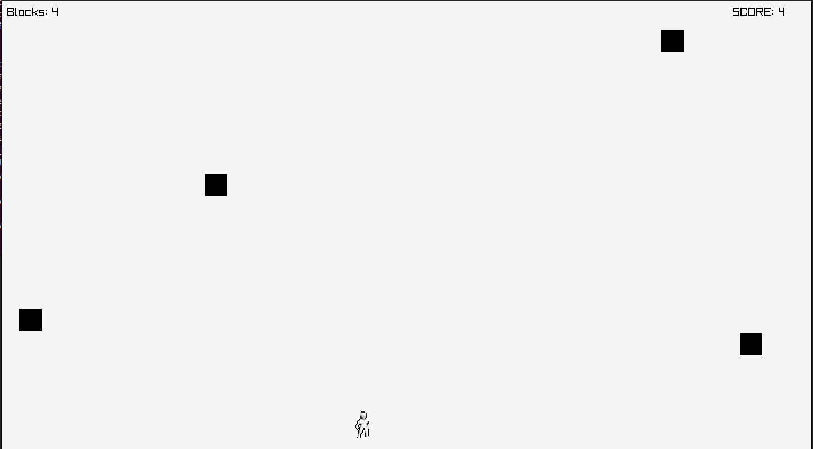

# 🚧 Dodge the Blocks

A simple arcade-style game built using [Raylib](https://www.raylib.com/), where you control a character that must dodge falling blocks. The longer you survive, the higher your score. Your best score is saved between runs!

 *(Add a screenshot of the game here)*

---

## 🎮 Gameplay

- Use **A** and **D** keys to move left or right.
- Avoid falling blocks.
- Survive as long as possible to increase your score.
- If you're hit, the game ends, and your score is compared with the high score.
- Press **ENTER** or **TAP** to restart.

---

## 🧱 Features

- Basic animation loop using Raylib's state system.
- Player sprite and textured background.
- Procedural generation of falling blocks.
- Persistent score saving using a custom binary file.
- Sound effects.

---

## 🗂️ Project Structure

```
DodgeTheBlocks/
├── assets/
│   ├── Character.png         # Player texture
│   ├── die.wav               # Sound effect on death
│   └── img.png               # Background image
├── db/
│   └── score.data            # Binary file for storing scores
├── main.c                    # Main source file
└── README.md                 # This file
```

---

## 🛠️ How to Build

### Prerequisites

- [Raylib](https://github.com/raysan5/raylib) installed
- GCC or any C compiler
- CMake or manual Makefile (optional)

### Build (Linux/macOS)

```bash
gcc main.c -o DodgeTheBlocks -lraylib -lGL -lm -lpthread -ldl -lrt -lX11
./DodgeTheBlocks
```

### Build (Windows)

Use [MinGW](http://www.mingw.org/) and Raylib compiled for Windows.

```bash
gcc main.c -o DodgeTheBlocks.exe -lraylib -lopengl32 -lgdi32 -lwinmm
```

---


## 📝 License

This project is open source and can be modified or distributed freely. Attribution appreciated.

---

## 🙌 Credits

- Developed with [Raylib](https://www.raylib.com/)
- Sound and art assets are placeholders — replace them as needed.